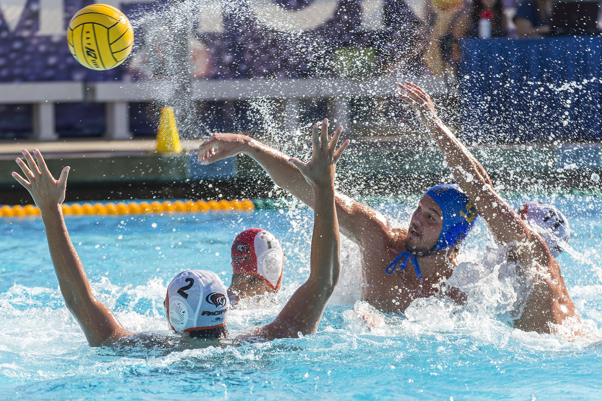
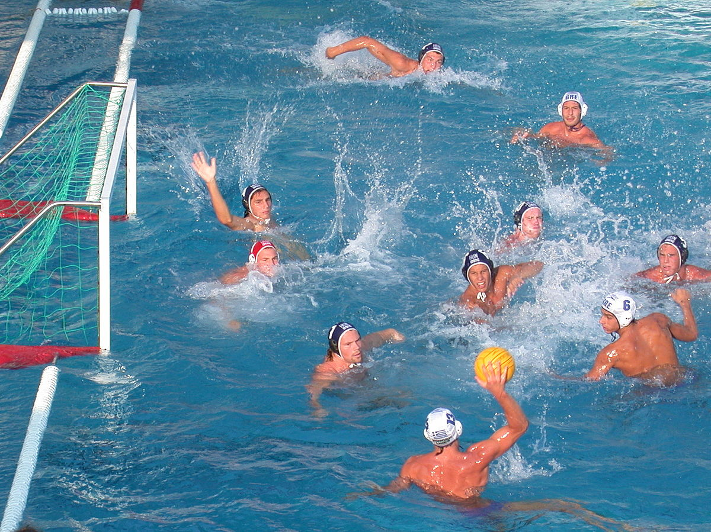

# Having Fun in the Water 

In a regular summer without social restrictions, most people are excited to relax with water whether in a pool or a beach. Besides just relaxing and floating, the only other thing people think of is swimming. It is fun to swim with friends and just rest in the water but what if you wanted more action. That's where my hobby and favorite olympic sport, water polo comes in. 

## What is Water Polo?

Water Polo is a team sport consiting of 6 field players and a goalie where the objective is to get the ball into the other team's goal more times than they get the ball into your goal. It may sound similar to soccer but you are only allowed to catch and hold onto the ball with one hand. Also water polo is not for the faint of heart as it is a full contact sport with little protection (Only a cap that prevents your ears from getting torn off). With that being said, most referees take player safety very seriously and if caught doing things like hitting, drowning, or any other fouling will have consequences. To learn more about the basic rules of water polo visit this website [Water Polo Rules](https://fitpeople.com/sports/others-sports/the-basic-rules-of-water-polo/). This image is a good representation of the contact and chaos allowed in water polo. 

On the other hand this image is an overview of the controlled chaos and setups of the players. 

### Why is Water Polo fun?
Water Polo is not fun because of the rules of play and the amount of contact allowed but like any other sport it's fun because of the possiblity to get better and to win. You can always improve. It takes the strength and endurance of swimming (without the bordem of repetiton) and combines it with the excitement of a team sport. I have great memories having fun with my teammates and have more trust in each other as we play more games. There is a lot of teamplay needed to score or defend one goal and the scores in a water polo game are usually single digit. You have to be able to trust your teammate in passing it perfectly to you or you might slow down. It's a sense of confidence in other people that you can only experience if you have participated in it but will last as long as you know them. 
